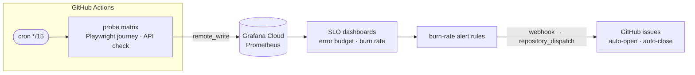
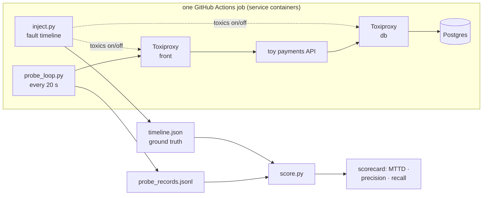

# synthetic-slo-harness

**In plain English:** scripted "robot users" visit a web app and an API every 15 minutes,
report health to live dashboards, and raise an alarm when things degrade. Then — the part
that makes this a project — the harness **breaks the app on purpose, on a schedule**, to
measure whether the alarms fire, how fast, and how often they cry wolf.

> Synthetic monitoring built from the tools an SDET already owns — Playwright journeys and API
> probes scheduled by GitHub Actions, feeding Grafana Cloud SLO dashboards — and then the part
> monitoring vendors don't publish: **the monitoring itself gets tested.** Faults are injected
> on a known timeline, and detection is scored against that ground truth.

**Status: scaffolded.** Probes, metrics pipeline, fault injection and scoring are built,
unit-tested, and green in CI. Quiet-week baseline collection and the first scored fault runs
are next. **No measured numbers are claimed yet.**

## What is being monitored?

This is a **portfolio project** — there is no company behind it, and that is by design. The
system under evaluation here is *the monitoring itself*, so the monitored applications are
deliberately simple and fully controlled:

| role | application | why this one |
|---|---|---|
| Continuous target (browser) | [saucedemo.com](https://www.saucedemo.com) — SauceLabs' public practice storefront | stands in for "your production web app": a real login → cart → checkout flow, probed the way Checkly probes a customer's site |
| Continuous target (API) | [githubstatus.com](https://www.githubstatus.com) status API | stands in for "your production API": a public, stable endpoint probed at a polite cadence |
| Fault-injection target | a **toy payments API** (FastAPI + Postgres, in this repo) | written specifically to be broken: the harness cuts its DB, ramps its latency, and takes it down **on a known schedule** — which is what makes detection scorable against ground truth |

In other words: the demo apps play the part of the product; the engineering being
demonstrated is everything wrapped around them. Swap `targets.yml` to point at a real
application and the same harness monitors that instead.

## What this project demonstrates

- **Test engineering discipline** — every claim is measured against injected ground truth:
  known fault timelines, a detection rule frozen before scoring, raw data published so every
  number is recomputable. Same method as my
  [pytest-ai-triage](https://github.com/varunbhatt2193/pytest-ai-triage) project.
- **Hands-on GitHub Actions, as the product** — cron scheduling, matrix fan-out, reusable
  workflows (`workflow_call`), a composite action, service containers, concurrency groups,
  caching, artifacts, job summaries, `repository_dispatch` issue automation.
- **Observability / SRE vocabulary with evidence attached** — Prometheus remote_write (the
  wire protocol, hand-implemented and unit-tested), Grafana Cloud, SLOs, error budgets,
  multiwindow burn-rate alerting, MTTD, alert precision/recall.
- **Playwright beyond test suites** — browser journeys as production probes, the pattern
  behind Checkly and Grafana Synthetic Monitoring's browser checks.

## The idea in three sentences

1. GitHub Actions is the monitoring platform, not just a test runner: cron probes, a reusable
   workflow, a composite action, and service containers are the whole system.
2. Every probe result lands in Grafana Cloud as Prometheus metrics — availability, latency,
   per-journey-step timings — driving SLO error budgets and burn-rate alerts.
3. Because faults are injected on a schedule the harness controls, the monitoring gets a
   scorecard: time-to-detect per fault class, alert precision and recall, false positives per
   quiet week.

## How the continuous monitoring works



- `probe.yml` fires every 15 minutes and calls the reusable `run-probes.yml`, which fans out a
  matrix of targets × probe kinds through the `playwright-synthetic-probe` composite action.
- Two targets, on purpose and politely: one browser journey on SauceLabs'
  [saucedemo](https://www.saucedemo.com) practice store, one API check on
  [githubstatus](https://www.githubstatus.com). One run each per tick, nothing hammered.
- Each run also records `synthetic_cron_jitter_seconds` — how late the cron actually fired.
  That jitter is the detection floor of Actions-native monitoring, and publishing it is part
  of the point.

## How the monitoring gets tested

The whole target stack runs as **service containers inside one Actions job** — nothing
deployed, nothing paid for. `inject.py` degrades it on a known timeline while `probe_loop.py`
watches through the proxy; `score.py` compares what the probes saw against what actually
happened.



Every run is baseline → fault → recovery, so each scorecard contains both a detection test
and a false-positive test.

### The three fault classes

| fault | mechanism | what it proves |
|---|---|---|
| `latency_ramp` | latency toxic stepped 500 → 1500 → 3000 ms | latency SLO detection as degradation crosses the threshold mid-ramp |
| `error_burst` | DB link cut; API stays up, returns 503s | the failure a shallow `/health` check cannot see |
| `hard_outage` | front proxy disabled; connections refused | plain availability detection |

### What gets measured

| metric | definition |
|---|---|
| **MTTD** per fault class | minutes from injected fault start to detection — probe-level and alert-level, scored separately |
| **Precision / recall** | detection episodes matching an injected fault vs noise; faults that never alerted |
| **False positives / quiet week** | detection episodes across ≥7 days with no injected faults |
| **Scheduler jitter** | actual GHA cron delay vs the */15 grid (p50/p95) |
| **Probe-suite health** | flake rate and duration trend of the probes themselves |

The detection rule is frozen in `faults/score.py` (≥2 consecutive breaching cycles; a cycle
breaches on a failed check or latency over the SLO). Tuning after seeing results gets
reported as a second round — never merged silently.

## Repo tour

| path | what lives there |
|---|---|
| `probes/` | the probes, as pytest tests; `conftest.py` times steps, pushes metrics, dumps JSONL evidence |
| `src/slo_harness/` | hand-rolled minimal Prometheus remote_write encoder (unit-tested against an independent decoder), metrics buffer, target registry, Toxiproxy client |
| `faults/` | `inject.py` (ground-truth timeline), `probe_loop.py` (tight-loop probe), `score.py` (scorecard) |
| `service/` | toy payments API, reused from [pytest-ai-triage](https://github.com/varunbhatt2193/pytest-ai-triage) — a service written to be broken in known ways; deliberate, disclosed reuse |
| `.github/actions/playwright-synthetic-probe/` | the composite action every probe goes through; Marketplace-bound |
| `.github/workflows/` | `probe` (cron) · `run-probes` (reusable) · `fault-eval` · `alert-issues` · `build-image` · `ci` |

## Run it locally

```bash
uv sync
uv run pytest                                     # unit tests, no network
uv run pytest probes --target githubstatus        # one live API probe
uv run playwright install chromium
uv run pytest probes --target saucedemo --browser chromium   # one live journey
```

Full fault evaluation on your machine (compressed timeline, ~3 minutes):

```bash
docker compose up -d --build
uv run python faults/inject.py --fault error_burst \
    --baseline-min 1 --fault-min 1 --recovery-min 1 &
uv run python faults/probe_loop.py --duration-min 3 --interval-s 10
uv run python faults/score.py        # prints the scorecard
```

No Grafana credentials? Probes skip the metrics push and still write
`probe-results/points.jsonl` — local runs need nothing.

## One-time setup

Grafana Cloud wiring — remote_write secrets, the alert webhook → GitHub issues bridge, and
alert-level scoring credentials — is documented step-by-step in
[docs/setup-grafana.md](docs/setup-grafana.md). The original project plan lives in
[docs/spec.md](docs/spec.md).

## Limits — read before quoting numbers

- **GHA cron is best-effort.** Firing can slip minutes. That jitter is measured and published
  rather than hidden; it is the detection floor of the cron path. Needing sub-minute detection
  is exactly the line where you buy Checkly or Grafana Synthetic Monitoring instead.
- Single region (GitHub-hosted runners). No geographic diversity.
- Grafana Cloud free tier keeps 14 days of metrics — quiet-week analysis must run inside that
  window.
- Two targets at a 15-minute cadence: built to demonstrate the method, not to monitor the
  internet.
